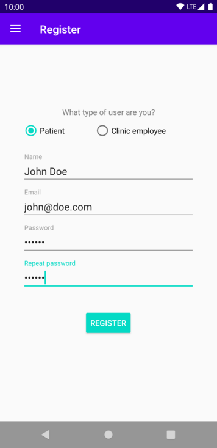
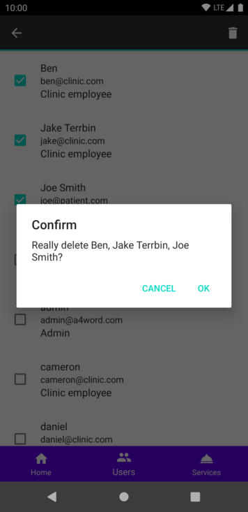
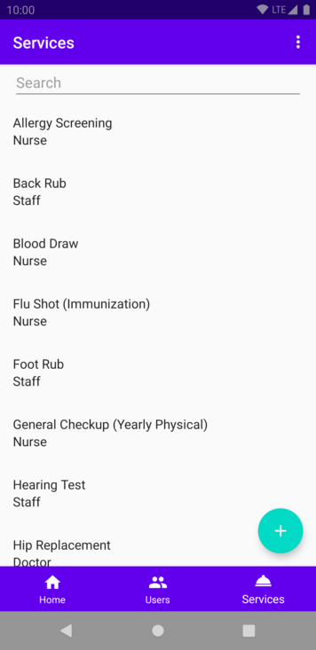

# Walk in Clinics Services App
## Introduction

The goal of this project was to create a walk in clinic services application for Android.
The purpose was to expand on the ideas of the theoretical concepts introduced in the lectures.
Such concepts include and increased understanding of software engineering theory such as reusable software,
software design, usability, patterns, software modeling with UML and object oriented design.
The project also built upon practicality of the labs by allowing us to have more experience with android development
and by allowing us to experience what the work environment might entail as a software engineer.   

## Team Members

| Name | Student Number |
| - | - |
| Aksh Babbar | 300034042 |
| Cameron Cardiff |300068033|
| Ben Herweyer | 300097196 |
| Daniel Tang | 0300068985 |
| Rohaan Williams | 300010136 |

# Domain Model

# Screenshots

## Login

 &nbsp; 

## Registration

 &nbsp; 

## Admin UI

### Admin Users

 &nbsp; 

### Admin Services

 &nbsp;  &nbsp;  &nbsp;  &nbsp;  &nbsp; 

## Clinic UI

### Dashboard

### Clinic profile

### Clinic services

 &nbsp;  &nbsp;  &nbsp;  &nbsp; 

### Clinic working hours

 &nbsp;  &nbsp;  &nbsp; 

## Patient UI

### Dashboard

### Search

 &nbsp;  &nbsp;  &nbsp; 

### Clinic details

### Booking

 &nbsp; 

### Rating

## Lessons learned

- Introducing complicated paradigm shifts like RxJava (functional asynchronous programming) at the same time as learning Android, ORMs, SQL development makes it difficult for all team members to learn the new tools and work together efficiently.
- Work done individually should be shared with team often to keep them up to speed as well as avoid bugs.
